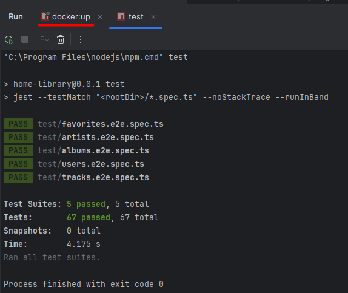
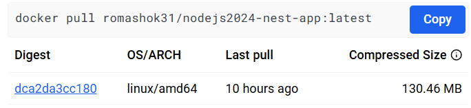
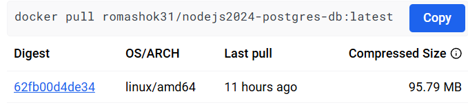
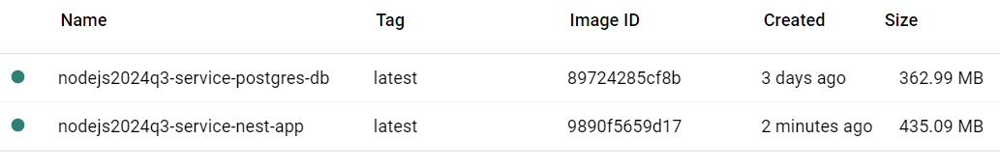

# Home Library Service

## Prerequisites

- Git - [Download & Install Git](https://git-scm.com/downloads).
- Node.js - [Download & Install Node.js](https://nodejs.org/en/download/) and the npm package manager.
- Docker. [Download & Install Docker](https://docs.docker.com/engine/install/).  

## Downloading

```git clone https://github.com/Gemer31/nodejs2024Q3-service.git```

## Running application

1. Create **.env** file based on **.env.sample**(just rename .env.sample => .env).
2. Install dependencies: ``npm install -f``
3. Use Docker Compose to run the application: ``npm run docker:up``.
Use http://localhost:4000/api (port 4000 it is a default application port in .env) to work with application api.

## Stop application

To stop containers without their deletion: ``npm run docker:stop``.
To stop containers with deletion images, containers and volumes: ``npm run docker:down:all``.

Also you can use Docker Desktop to manage containers, images and volumes.

## Testing

For testing API use command: ``npm run test``.



**NOTE!:** Application has to be run and node_modules have been installed

## Docker hub images

```
romashok31/nodejs2024-nest-app:latest
romashok31/nodejs2024-postgres-db:latest
```





## Docker security check

Scripts to check Docker images for vulnerabilities:

``npm run docker:scout:app (application image)``<br>
``npm run docker:scout:db (database image)``

### Auto-fix and format

``npm run lint``

``npm run format``

### Debugging in VSCode

Press <kbd>F5</kbd> to debug.

For more information, visit: https://code.visualstudio.com/docs/editor/debugging
